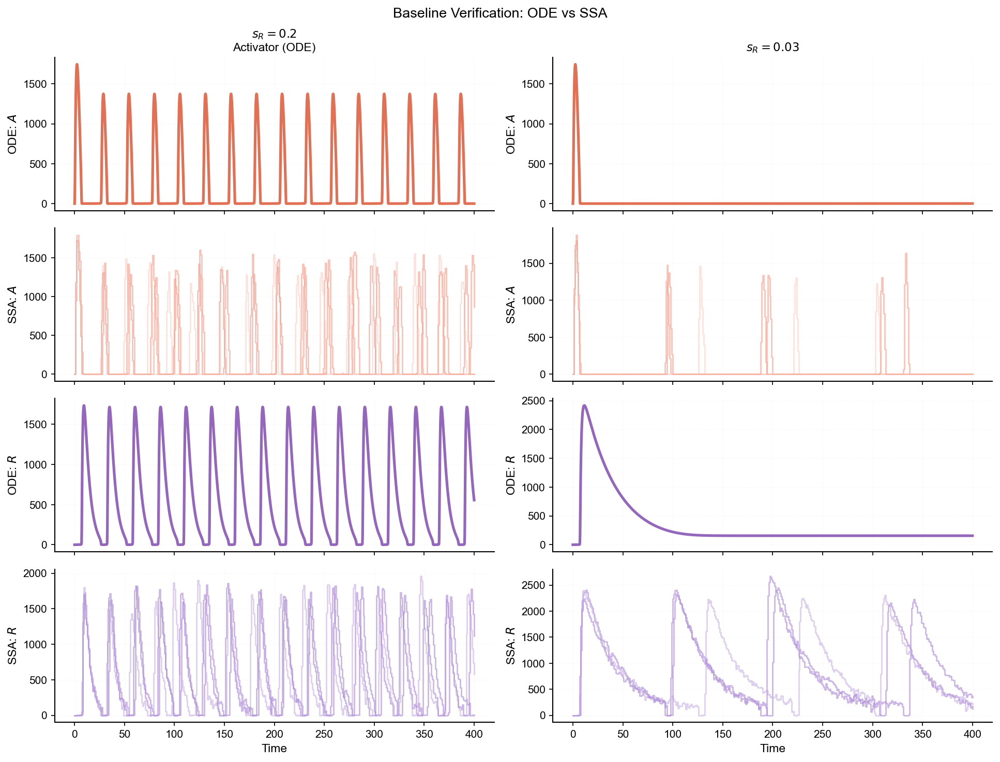
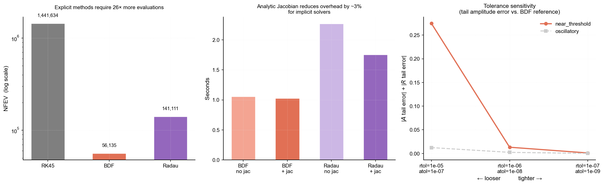
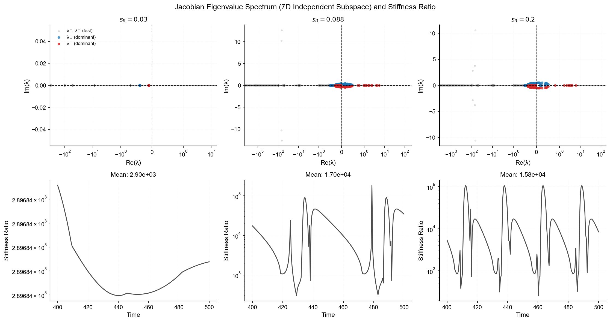
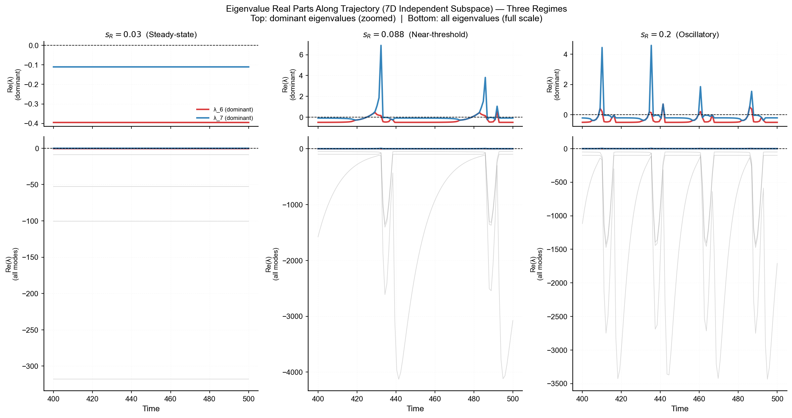
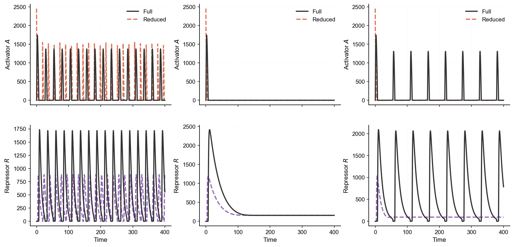
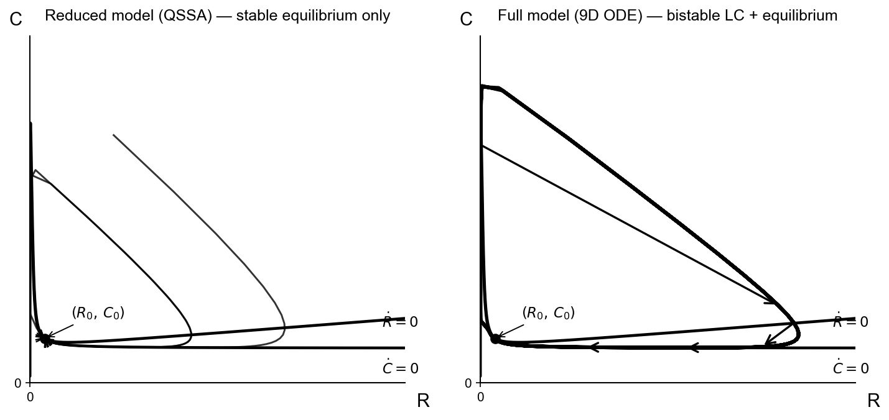
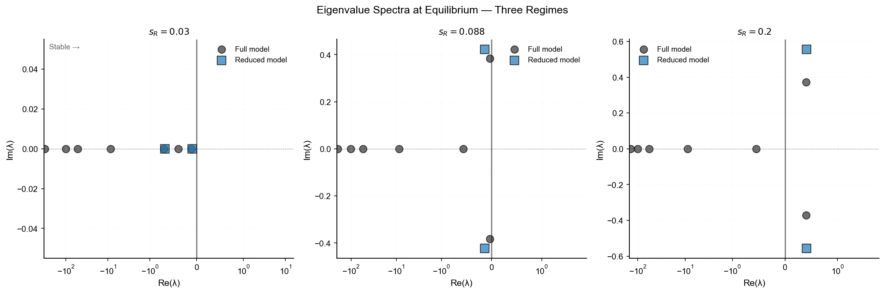
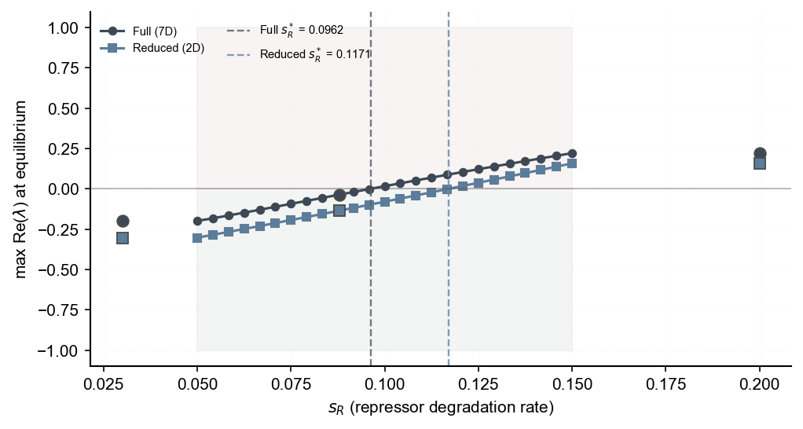
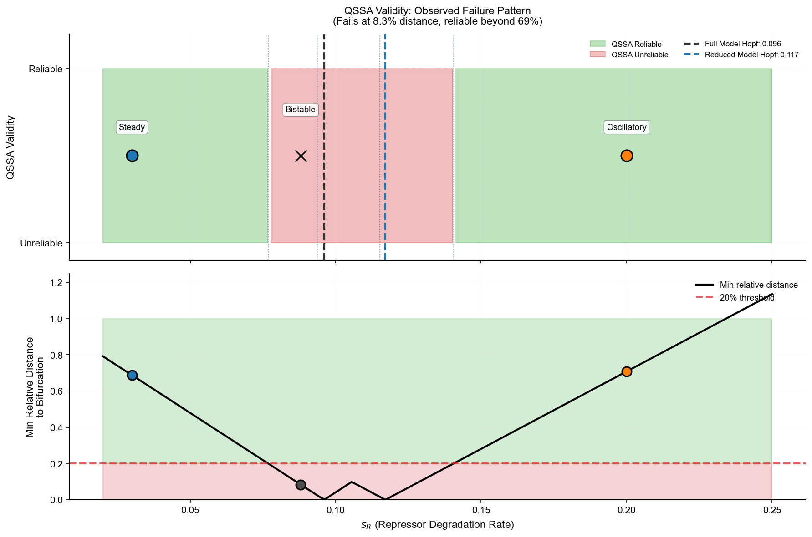

# Numerical Analysis of a Genetic Oscillator

## Introduction

This project reproduces and extends the Vilar-Kueh-Barkai (VKB) genetic oscillator model [1]. The original paper proposed the 9-variable model, demonstrated its noise-resistance mechanisms, and derived a 2-variable QSSA reduction. The main analysis focuses on deterministic ODE dynamics and examines how extreme timescale separation affects numerical integration and model reduction, which are aspects not explored in the original work. A central contribution is a bifurcation-distance-based validity criterion for QSSA model reduction.

Timescale separation has two consequences: numerical stiffness that increases integration cost, and the possibility of QSSA model reduction. Dimension reduction can also change phase-space topology near bifurcation boundaries by eliminating attractors and shifting critical thresholds. These effects are quantified through solver benchmarks, eigenvalue analysis, bifurcation comparisons, and basin-of-attraction sampling.

## Research Questions

**Q1: Numerical Cost**: How expensive is stiff integration, and why?

The system has extreme timescale separation. This project benchmarks explicit and implicit solvers, then uses eigenvalue spectrum analysis to explain the cost difference.

**Q2: Model Reduction**: When does QSSA work, and when does it fail?

Trajectory comparison across parameter regimes identifies where QSSA breaks down. Bifurcation analysis reveals that dimension reduction shifts critical thresholds and eliminates attractors.

Note: This work focuses on deterministic dynamics. SSA is used as a supplementary baseline check and to illustrate one regime where deterministic and stochastic trajectories diverge; stochastic bifurcation analysis is beyond scope.

**Parameter Selection**: Three values of $s_R$ (repressor degradation rate) were chosen to probe different regimes:

- $s_R = 0.2$ (baseline): Both ODE and SSA exhibit sustained oscillations.
- $s_R = 0.088$ (near-threshold regime): The parameter region used to test QSSA behavior close to the stability boundary.
- $s_R = 0.03$ (supplementary SSA case): A regime where ODE and SSA trajectories diverge.

## Methods

## Tech Stack

- **Language**: Python 3.9
- **Numerical computing**: NumPy, SciPy
- **Visualization**: Matplotlib
- **Stochastic simulation**: GillesPy2 (SSA)
- **Environment management**: Conda

### VKB Reaction Network

The core of the model is a 9-species biochemical reaction network comprising 16 reactions. The original paper analyzed this network through two complementary frameworks:

- **Deterministic (ODE)**: Continuous dynamics used for stiffness analysis, bifurcation study, and model reduction.
- **Stochastic (SSA)**: Simulated via the Gillespie algorithm to verify the robustness of oscillations under molecular noise and validate the ODE implementation.

<div align="center">

| Variable | Biological Meaning | Timescale |
|----------|-------------------|-----------|
| $D_A$, $D_A'$ | Activator promoter (free/bound) | Fast (~$10^{-3}$) |
| $D_R$, $D_R'$ | Repressor promoter (free/bound) | Fast (~$10^{-3}$) |
| $M_A$ | Activator mRNA concentration | Intermediate |
| $M_R$ | Repressor mRNA concentration | Intermediate |
| $A$ | Activator protein concentration | Intermediate (fast relative to $R$/$C$) |
| $R$ | Repressor protein concentration | Slow |
| $C$ | A·R complex concentration | Slow |

</div>

The key parameter $s_R$ (repressor degradation rate) controls which dynamical regime the system occupies.

### Numerical Integration and Stiffness Analysis

Due to large variations in reaction rates, the ODE representation is stiff. The integration efficiency of three solvers was benchmarked and compared:
- **RK45**: A standard explicit method (usually unsuited for stiff problems)
- **BDF**: An implicit Backward Differentiation Formula method
- **Radau**: An implicit Runge-Kutta method of the Radau IIA family

To verify the ODE implementation, stochastic simulation runs were performed using the `GillesPy2` library. Comparing the deterministic ODE trajectories against the SSA trajectories confirms correctness and identifies regimes where deterministic and stochastic dynamics diverge.

### ODE Model Reduction (QSSA)

This project reduces the 9-variable ODE system to a 2-variable manifold ($R$, $C$) by applying the Quasi-Steady-State Assumption (QSSA). The fast variables ($D_A$, $D_R$, $M_A$, $M_R$, $A$) are treated as algebraic constraints rather than differential ones, assuming their derivatives vanish on the slow timescale. This formulation allows assessment of how dimensionality reduction impacts the system's dynamical topology.

## Results

### Baseline Verification

The ODE and SSA implementations reproduce the dynamical behaviors reported in [1]. At $s_R = 0.2$, both frameworks agree on sustained oscillations. At $s_R = 0.03$, the deterministic ODE incorrectly predicts a stable steady state while the stochastic SSA captures noise-induced oscillations. This indicates a limitation of deterministic modeling in the presence of molecular noise.

<div align="center">


**Figure 1.** ODE–SSA comparison at two parameter settings: $s_R = 0.2$ (left) and $s_R = 0.03$ (right).
</div>

### Numerical Stiffness

**Solver Benchmark**

This project benchmarks three solvers at $s_R = 0.2$ to quantify the computational cost of stiffness.

<div align="center">


**Figure 2.** Numerical benchmark at $s_R = 0.2$ across RK45, BDF, and Radau.
</div>

**Eigenvalue Analysis**

The Jacobian spectrum along settled trajectories explains the cost difference. Eigenvalues are computed at multiple time points along the trajectory to analyze stiffness.

<div align="center">


**Figure 3.** Stiffness diagnostics for $s_R = 0.03$ (left) and $s_R = 0.2$ (right); top: eigenvalue plane, bottom: stiffness ratio.
</div>

<div align="center">


**Figure 4.** Eigenvalue real-part evolution for $s_R = 0.03$ (left) and $s_R = 0.2$ (right); top: two slow modes, bottom: all modes.
</div>

### QSSA Validity

**Trajectory Comparison**

The original paper derived the QSSA reduction and demonstrated agreement at $s_R = 0.2$. This project extends this comparison across three parameter regimes to identify where the approximation breaks down.

<div align="center">


**Figure 5.** Full (9D) and reduced (2D) trajectories for $s_R = 0.03$, $0.088$, and $0.2$.
</div>

The reduced model agrees with the full model in the steady-state and oscillatory regimes, but diverges near the bifurcation boundary.

**Bifurcation Analysis**

To understand why the models diverge at $s_R = 0.088$, equilibrium stability is computed across a range of $s_R$ values. For each $s_R$ value, the equilibrium point $y^*$ is computed by solving $dy/dt = 0$, and the eigenvalues of the Jacobian at equilibrium are then analyzed. The Hopf bifurcation occurs where $\max \text{Re}(\lambda) = 0$ (stability boundary).

**Attractor Coexistence at $s_R = 0.088$ (Near-Threshold Regime)**

Both models have locally stable equilibria ($\max \text{Re}(\lambda) < 0$) at this parameter value, yet exhibit topological divergence due to attractor loss in the reduced model. To verify this, 72 initial conditions are sampled around the equilibrium using random and axis-aligned perturbations. The trajectories were integrated until $t = 800$, significantly longer than the slowest relaxation timescale ($\tau \approx 28$). The results show that 39 trajectories converge to a limit cycle and 33 converge to the equilibrium.

In contrast, a phase space scan of the reduced model (625 initial conditions uniformly sampled in $(R, C) \in [0, 200] \times [0, 200]$) shows that all sampled trajectories converge to equilibrium within the scanned domain and integration horizon.

<div align="center">


**Figure 6.** Phase-space basin comparison at $s_R = 0.088$; left: reduced model, right: full model; top: overview, bottom: zoom.
</div>

The attractor coexistence (bistability) in the full model means the system can settle into either a steady state or sustained oscillations depending on initial conditions. The QSSA reduction eliminates this bistability and removes the limit-cycle attractor from the phase space. This indicates a limitation of model reduction in systems biology, where reduced models may lose quantitative accuracy and miss dynamical regimes, leading to qualitative changes in phase-space topology.

The eigenvalue spectra at equilibrium (Figure 7) and shifted bifurcation boundaries (Figure 8) explain this mechanism.

<div align="center">


**Figure 7.** Equilibrium eigenvalue spectra for $s_R = 0.03$, $0.088$, and $0.2$ in full and reduced models.
</div>

<div align="center">


**Figure 8.** Bifurcation scan over $s_R$ using the maximum equilibrium eigenvalue real part.
</div>

The bifurcation analysis shows that the full model crosses the stability boundary at $s_{R,\text{Hopf}} \approx 0.096$, while the reduced model crosses at $s_{R,\text{Hopf}} \approx 0.117$, corresponding to a 22% shift. This shift is consistent with the reduced system's altered local linearization, which changes the parameter value at which the dominant eigenvalue pair crosses $\mathrm{Re}(\lambda)=0$. This mechanism explains why at $s_R = 0.088$, the full model exhibits bistability (coexistence of equilibrium and limit-cycle attractors) while the reduced model has only a single equilibrium attractor.

**QSSA Validity: A Bifurcation-Distance Criterion**

This project defines a *bifurcation-distance criterion* for QSSA validity based on the relative distance to the nearest Hopf bifurcation threshold: $d_\text{bif} = \min\left(|s_R - s_{R,\text{Hopf}}|\, /\, s_{R,\text{Hopf}}\right)$. The approximation remains accurate at $s_R = 0.03$ ($d_\text{bif} = 69\%$), fails in the near-threshold regime ($s_R = 0.088$, $d_\text{bif} = 8\%$), and recovers qualitatively in the oscillatory regime ($s_R = 0.2$, $d_\text{bif} = 108\%$). The observed failure at $d_\text{bif} \lesssim 10\%$ provides a practical bound for when QSSA may produce qualitative changes in phase-space topology.

<div align="center">


**Figure 9.** QSSA validity summary against distance to the nearest bifurcation threshold.
</div>

## Discussion

For modelers working with stiff systems biology models, these findings suggest two practical guidelines:

1. **Solver selection**: Implicit methods (BDF, Radau) are generally more efficient when timescale separation exceeds ~10³. The 26× cost difference observed here is substantial for parameter sweeps and uncertainty quantification.

2. **Model reduction validation**: QSSA benefits from bifurcation-distance validation in addition to timescale-separation checks. The 22% threshold shift and attractor elimination in the near-threshold regime ($s_R = 0.088$) indicate that reduced models can miss qualitatively different behaviors even when timescale separation remains large. The bifurcation-distance criterion ($d_\text{bif} \lesssim 10\%$) provides a practical bound for QSSA reliability.

## Limitations

- **Empirical validity bound**: The $d_\text{bif} \lesssim 10\%$ boundary is an empirical guideline from the tested parameter regimes, not a formal theorem.
- **Finite-domain basin conclusions**: Basin conclusions are based on finite initial-condition sampling (625 reduced-model grid points and 72 full-model probes) and finite integration horizons.
- **Deterministic scope**: Main bifurcation and reduction conclusions are based on deterministic ODE analysis; stochastic bifurcation structure is not analyzed in this project.
- **Numerical root-finding caveat**: Near the bifurcation boundary, equilibrium root-finding may report non-physical intermediate solutions; thresholds should be interpreted together with trajectory and basin evidence.

## Quick Start

Recommended Python version: **Python 3.9**

```bash
conda create -n genetic-oscillators python=3.9
conda activate genetic-oscillators
pip install -r requirements.txt

# Run individual analyses
python main.py baseline      # Verify implementations
python main.py numerics      # Benchmark solvers
python main.py stiffness     # Eigenvalue analysis along trajectories
python main.py reduction     # Compare full vs reduced models
python main.py bifurcation   # Bifurcation analysis + QSSA validity criterion
python main.py basin         # Attractor coexistence test

# Or run complete pipeline
python main.py all
```

Notes:
- `basin` is computationally intensive (~10 min); all other steps complete in under a minute.
- To reduce runtime, modify `n_grid=25` to `n_grid=15` in `main.py`.

## References

[1] Vilar, J. M., Kueh, H. Y., Barkai, N., & Leibler, S. (2002). Mechanisms of noise-resistance in genetic oscillators. *PNAS*, 99(9), 5988-5992. https://doi.org/10.1073/pnas.092133899
