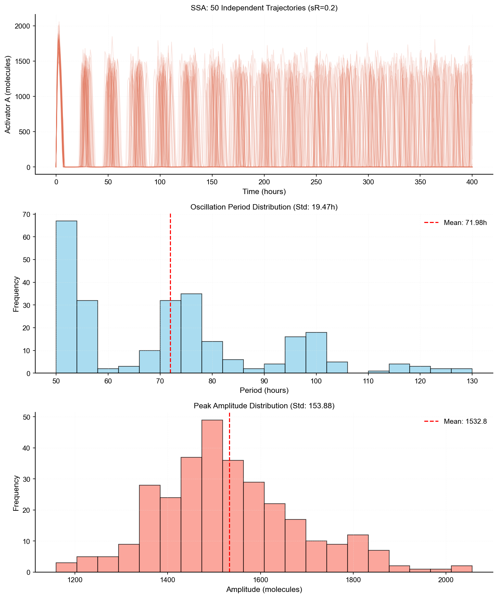
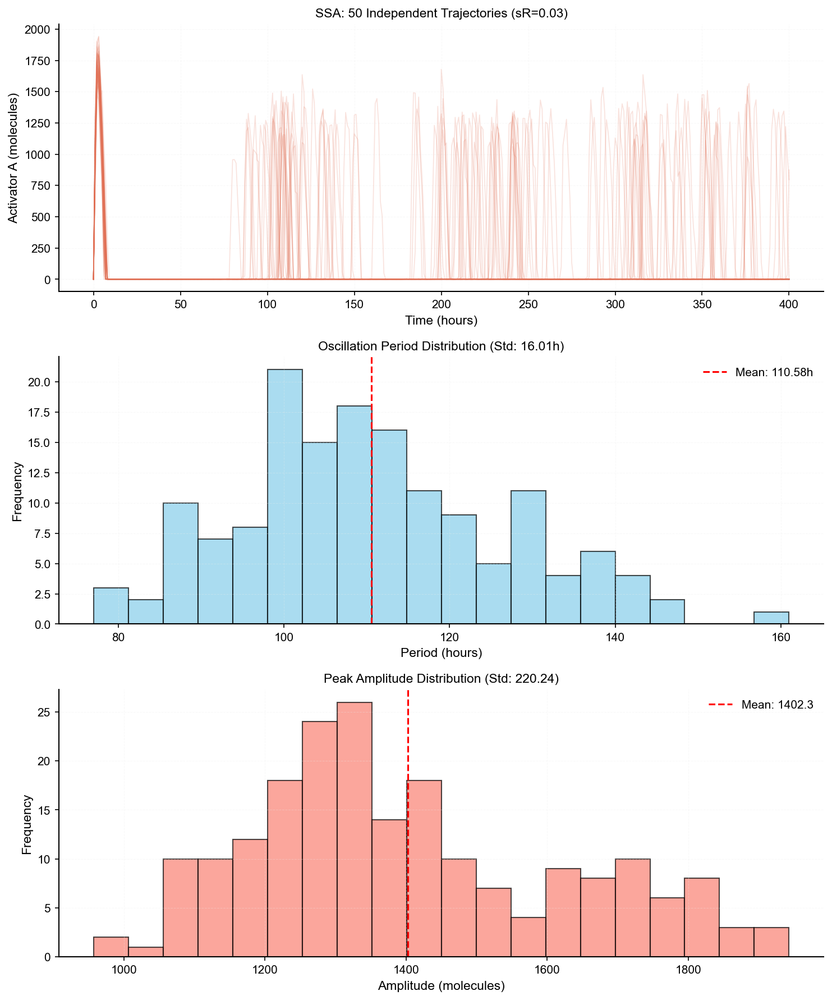
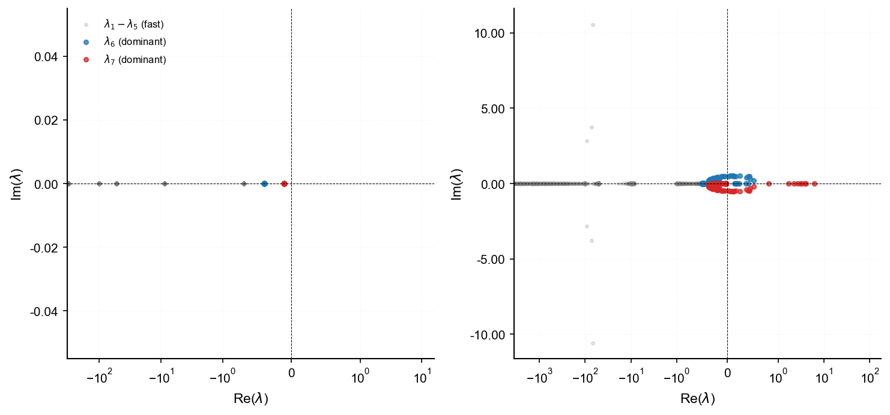
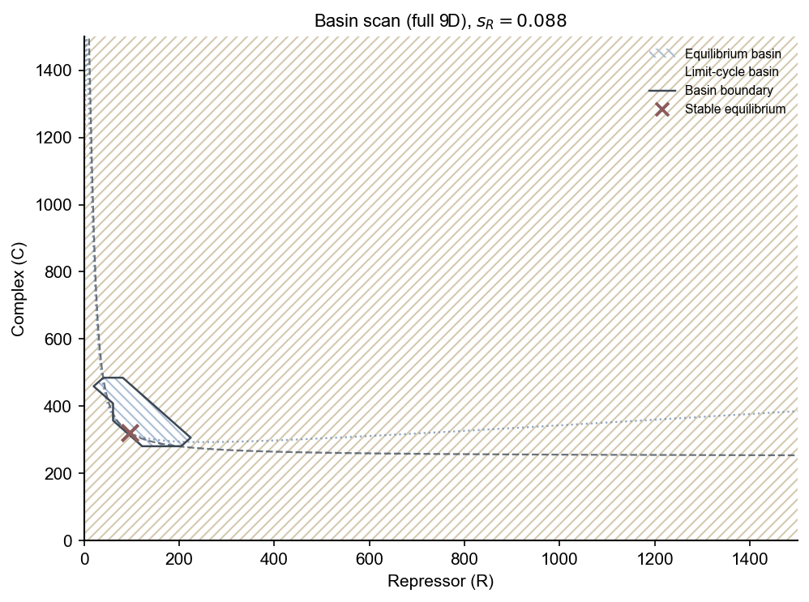

# Scientific Computing, Bridging Course, 2023 — Miniproject 2: Genetic Oscillator

Course project on the Vilar–Kueh–Barkai (VKB) circadian model (9-species ODE + Gillespie SSA). Parts A–D reproduce the paper's core results; the extension then tests whether the 2-variable QSSA reduction still matches the full model near the oscillatory transition. Main findings:

- The reduced model shifts the Hopf threshold upward by about 22% in $s_R$, creating a parameter window where the full and reduced models disagree qualitatively.
- Below the full model's Hopf point, a stable limit cycle can coexist with a stable equilibrium — subcritical bistability. The QSSA reduction removes this.
- At $s_R = 0.088$, a coarse phase-space probe (Figure 11) and a global 50×50 scan on the $(R,C)$ plane (Figure 12) both confirm the split: the reduced flow collapses to a single attractor while the full model retains a large limit-cycle basin.
- A distance-to-bifurcation heuristic ($d_\text{bif}$) gives a rough indication of when the reduction can be trusted.

Numeric values below come from the analysis code run with fixed tolerances. Figures 5, 7, and 12 require the full pipeline (slow). See [Appendix 2](#appendix-2-quick-start-and-reproducibility) and [docs/figure_pipeline.md](docs/figure_pipeline.md).

---

## 1. Background

The Vilar–Kueh–Barkai (VKB) model [1] describes a circadian clock driven by an activator (A) and a repressor (R), coupled through a 16-reaction, 9-variable biochemical network with mass-action kinetics. The original paper derives both a deterministic ODE formulation and a Gillespie SSA implementation, claiming the oscillator is noise-resistant.

This project reproduces the paper's core results (Parts A–D) and extends them with one focused question: the paper derives a 2-variable QSSA reduction in $(R,C)$ and validates it mainly at $s_R = 0.2$. The assignment shows a qualitative transition between $s_R = 0.03$ (ODE steady state) and $s_R = 0.2$ (ODE oscillations). Does the reduced model capture that transition, or does the simplification break down near the boundary? Section 3 addresses this.

---

## 2. Assignment tasks

### Part A: Deterministic model and solver benchmarks

The 9-dimensional ODE is solved at $s_R = 0.2$ over 400 simulated hours. The trajectory reproduces the sustained oscillations in Vilar et al. (2002), with a period of roughly 24 h (Figure 1).

<div align="center">


**Figure 1.** Deterministic ODE trajectory (400 h), activator A and repressor R at $s_R = 0.2$.
</div>

To compare solver performance, RK45, BDF, and Radau are run over 48 h with internal step logging (Figure 2). The system is stiff: RK45 takes steps on the order of $10^{-3}$ h in the steep phases, resulting in on the order of $10^6$ total function evaluations over a long run. BDF and Radau both take steps up to $\sim 1\,\mathrm{h}$ in the slow phase.

<div align="center">


**Figure 2.** Internal step sizes $\Delta t$ for RK45, BDF, and Radau over 48 h.
</div>

In the 48 h benchmark, BDF finished in about 0.12 s and Radau in about 0.21 s (wall time varies by hardware). Absolute trajectory errors against a high-precision RK45 reference ($\texttt{rtol}=10^{-12}$, $\texttt{atol}=10^{-14}$) are roughly $10^{-4}$–$10^{-6}$ for BDF and $10^{-8}$–$10^{-14}$ for Radau (Figure 3). Based on this, BDF is used for long exploratory runs and Radau where Jacobian eigenvalues must be accurate, for example when locating bifurcation points.

<div align="center">


**Figure 3.** Absolute trajectory error for BDF and Radau relative to a high-precision RK45 reference ($\texttt{rtol}=10^{-12}$, $\texttt{atol}=10^{-14}$).
</div>

### Part B: Stochastic model

The SSA is implemented using GillesPy2 with the same 16 reactions as the ODE. Figure 4 shows one 400 h trajectory at $s_R = 0.2$. The path oscillates qualitatively like the ODE limit cycle, though individual trajectories drift in phase and vary in amplitude.

<div align="center">


**Figure 4.** Single SSA trajectory (400 h), A and R at $s_R = 0.2$.
</div>

To quantify that variability, 50 independent SSA runs are collected and periods and amplitudes extracted via peak detection (Figure 5; regenerate with `python main.py stats` or `python main.py all --full`).

<div align="center">


**Figure 5.** 50 independent SSA trajectories at $s_R = 0.2$; period distribution $\mu_T \approx 24.3 \pm 0.4\,\mathrm{h}$ (for the run shown).
</div>

At $s_R = 0.2$, the SSA and ODE agree qualitatively — both show sustained oscillations with a roughly 24 h period. The spread in Figure 5 reflects stochastic phase drift and amplitude fluctuations.

### Part C: Noise-induced oscillations

At $s_R = 0.03$, the deterministic ODE settles to a stable equilibrium. SSA trajectories, however, remain oscillatory (Figure 6). This is noise-induced oscillation: the equilibrium is linearly stable, but stochastic fluctuations repeatedly kick the system into excitable excursions.

<div align="center">


**Figure 6.** ODE vs SSA at $s_R = 0.03$: the ODE decays to steady state while SSA continues to oscillate.
</div>

Running the same 50-trajectory statistics at $s_R = 0.03$ gives a much wider period distribution, with $\mu_T \approx 110 \pm 16\,\mathrm{h}$ for the run shown (Figure 7; same pipeline as Figure 5).

<div align="center">


**Figure 7.** 50 independent SSA trajectories at $s_R = 0.03$; period distribution is much wider than Figure 5.
</div>

The eigenvalue spectrum confirms the equilibrium is stable at $s_R = 0.03$ (all eigenvalues have negative real parts). The oscillatory SSA behavior is consistent with Vilar et al. (2002): the system is close enough to a Hopf bifurcation that noise drives sustained excursions even though the deterministic fixed point is stable.

<div align="center">


**Figure 8.** Jacobian eigenvalue spectra at $s_R = 0.03$ (steady) vs $s_R = 0.2$ (oscillatory).
</div>

### Part D: When ODE vs SSA matters

At $s_R = 0.2$, molecule counts are large enough that the mass-action ODE is a reasonable approximation, and the two approaches agree qualitatively. At $s_R = 0.03$, the ODE gives the wrong qualitative answer — it predicts a stable steady state while SSA shows oscillations. Stochastic modeling is structurally necessary near that parameter regime.

The same logic applies to model reduction within the deterministic setting: simplifications accurate at $s_R = 0.2$ can fail near the oscillatory transition. That question drives Section 3.

---

## 3. Extension: QSSA reduction and validity

The paper's 2D QSSA in $(R,C)$ is presented as a simplification of the full 9D model. This extension tests how far that simplification holds, focusing on the parameter region where the two models disagree.

**Step 1 — Hopf threshold comparison**

The Hopf bifurcation is located for both models by scanning $s_R$ and finding where $\max \mathrm{Re}(\lambda) = 0$ at the equilibrium. For the full model, a 7D algebraic reduction enforcing $D_A + D_A' = 1$ and $D_R + D_R' = 1$ is used to avoid the two spurious zero eigenvalues from those conservation constraints. Near the bifurcation, direct root-finding becomes ill-conditioned, so continuation in $s_R$ is used instead.

The result: the QSSA raises the Hopf threshold by about 22%, from $s_{R,\mathrm{Full}} \approx 0.096$ to $s_{R,\mathrm{Reduced}} \approx 0.117$.

<div align="center">


**Figure 9.** $\max \mathrm{Re}(\lambda)$ at equilibrium vs $s_R$ for the full and reduced models. The grey band $[0.096, 0.117]$ marks the region where they disagree on stability.
</div>

**Step 2 — Subcritical bistability at $s_R = 0.088$**

Below the full model's Hopf point, the bifurcation is subcritical: a stable limit cycle coexists with the stable equilibrium. This is examined at $s_R = 0.088$, where the eigenvalue evaluation gives $\max \mathrm{Re}(\lambda) \approx -0.036$ — the equilibrium is linearly stable, yet the system can converge to either attractor depending on the initial condition.

To probe the basin structure without a full grid scan, 72 initial conditions are integrated: one biological IC from the paper, 64 random perturbations of the equilibrium at four amplitude scales (16 draws per scale, RNG seed 42), and 7 axis-aligned perturbations. Of those, 39 converged to the limit cycle and 33 to the equilibrium. The reduced model shows no such coexistence over the scanned region — all trajectories settle to a single attractor.

**Step 3 — Trajectory comparison**

<div align="center">


**Figure 10.** Full vs reduced model trajectories at $s_R = 0.088$, starting from the same initial condition. The full model reaches the limit cycle; the reduced model settles to equilibrium.
</div>

**Step 4 — Basin of attraction: coarse probe (Figure 11) vs global grid (Figure 12)**

Figure 11 overlays the 25×25 reduced-model phase portrait with the 72-IC full-model probe described above. It shows the two models side by side in $(R,C)$ space.

<div align="center">


**Figure 11.** Coarse phase-space comparison at $s_R = 0.088$: reduced $25\times 25$ grid (background) plus 72 full-model initial conditions (markers), colored by attractor.
</div>

Figure 12 uses a 50×50 grid on a large $(R,C)$ slice. Each grid point is lifted to 9D via QSSA and integrated to convergence — 2500 independent ODE solves, parallelized and cached in `materials/basin_scan_sR_0.088_50x50.pkl` to avoid re-running. The result shows the equilibrium basin as an isolated region inside a dominant limit-cycle basin.

<div align="center">


**Figure 12.** Global 50×50 basin scan of the full model at $s_R = 0.088$. Hatching style distinguishes limit-cycle basin (/////) from equilibrium basin (\\\\). Slow to regenerate; use `python main.py basin-grid --plot-only` to replot from cache.
</div>

**Step 5 — When is the QSSA trustworthy?**

A normalized distance-to-bifurcation is defined as $d_\text{bif} = |s_R - s_{R,\mathrm{Hopf}}| / s_{R,\mathrm{Hopf}}$ and plotted for both models (Figure 13). When $d_\text{bif}$ is small, the QSSA is more likely to give a qualitatively wrong answer. The subcritical nature of the full-model bifurcation makes this worse: the danger zone extends below the Hopf $s_R$ even while the equilibrium is still linearly stable.

<div align="center">


**Figure 13.** $d_\text{bif}$ vs $s_R$ for the full and reduced models. The shaded region marks where the reduction is unreliable.
</div>

---

## 4. Conclusion

1. **Solvers:** BDF is the practical choice for long simulations of this stiff system. Radau is slower but accumulates less error, which matters when computing Jacobian eigenvalues near a bifurcation.
2. **ODE vs SSA:** At $s_R = 0.2$, the ODE and SSA agree qualitatively, and the ODE is sufficient. At $s_R = 0.03$, the ODE gives the wrong qualitative picture — SSA is needed to see the noise-induced oscillations.
3. **QSSA validity:** The 2D reduction matches the full model well away from the oscillatory transition. Near the Hopf boundary, it shifts the threshold by ~22% and loses the subcritical bistability present in the full model. The $d_\text{bif}$ heuristic flags where the reduction is risky, but the subcritical structure means the reliable region is smaller than the threshold shift alone would suggest.

---

## Appendix

### Appendix Table 1: 16-reaction network

The following reactions are shared by the 9-variable ODE and the Gillespie SSA.

<div id="appendix-table-1" align="center">

| Reaction                                   | Propensity / Rate  | Description               |
| :----------------------------------------- | :----------------- | :------------------------ |
| $A + R \xrightarrow{\gamma_C} C$           | $\gamma_C A R$     | Complex formation         |
| $A \xrightarrow{\delta_A} \emptyset$       | $\delta_A A$       | Activator degradation     |
| $C \xrightarrow{\delta_A} R$               | $\delta_A C$       | Complex degradation (A)   |
| $R \xrightarrow{\delta_R} \emptyset$       | $\delta_R R$       | Repressor degradation     |
| $D_A + A \xrightarrow{\gamma_A} D_A'$      | $\gamma_A D_A A$   | Promoter binding (A)      |
| $D_R + A \xrightarrow{\gamma_R} D_R'$      | $\gamma_R D_R A$   | Promoter binding (R)      |
| $D_A' \xrightarrow{\theta_A} D_A + A$      | $\theta_A D_A'$    | Promoter dissociation (A) |
| $D_R' \xrightarrow{\theta_R} D_R + A$      | $\theta_R D_R'$    | Promoter dissociation (R) |
| $D_A \xrightarrow{\alpha_A} D_A + M_A$     | $\alpha_A D_A$     | Transcription (A, basal)  |
| $D_A' \xrightarrow{\alpha_A'} D_A' + M_A$  | $\alpha_A' D_A'$   | Transcription (A, active) |
| $D_R \xrightarrow{\alpha_R} D_R + M_R$     | $\alpha_R D_R$     | Transcription (R, basal)  |
| $D_R' \xrightarrow{\alpha_R'} D_R' + M_R$  | $\alpha_R' D_R'$   | Transcription (R, active) |
| $M_A \xrightarrow{\delta_{M_A}} \emptyset$ | $\delta_{M_A} M_A$ | mRNA degradation (A)      |
| $M_R \xrightarrow{\delta_{M_R}} \emptyset$ | $\delta_{M_R} M_R$ | mRNA degradation (R)      |
| $M_A \xrightarrow{\beta_A} M_A + A$        | $\beta_A M_A$      | Translation (A)           |
| $M_R \xrightarrow{\beta_R} M_R + R$        | $\beta_R M_R$      | Translation (R)           |

</div>

### Appendix 2: Quick start and reproducibility

**Environment:** Python **3.9+** recommended.

```bash
conda create -n genetic-oscillators python=3.9
conda activate genetic-oscillators
pip install -r requirements.txt
```

**Pipelines**

| Command                                 | Purpose                                                                        | Rough time                                    |
| --------------------------------------- | ------------------------------------------------------------------------------ | --------------------------------------------- |
| `python main.py all`                    | Lite: figures 1–4, 6–11, 13 (no SSA stats batch, no 50×50 grid)                | Often ~10–40 min on a laptop (depends on CPU) |
| `python main.py all --full`             | Full: adds Figures 5, 7 (50 SSA trajectories) and Figure 12 (50×50 basin scan) | Often hours (SSA + 2500 ODE solves)           |
| `python main.py stats`                  | Only SSA statistics panels                                                     | Long (many SSA runs)                          |
| `python main.py basin-grid`             | Only 50×50 basin scan + Fig. 12                                                | Long                                          |
| `python main.py basin-grid --plot-only` | Replot Fig. 12 from `materials/basin_scan_sR_0.088_50x50.pkl`                  | Seconds                                       |

**Cached data:** The 50×50 basin scan is saved as `materials/basin_scan_sR_0.088_50x50.pkl`. Regenerate from scratch with:

```bash
python main.py basin-grid
```

## References

[1] Vilar, J. M., Kueh, H. Y., Barkai, N., & Leibler, S. (2002). Mechanisms of noise-resistance in genetic oscillators. *PNAS*, 99(9), 5988-5992.
