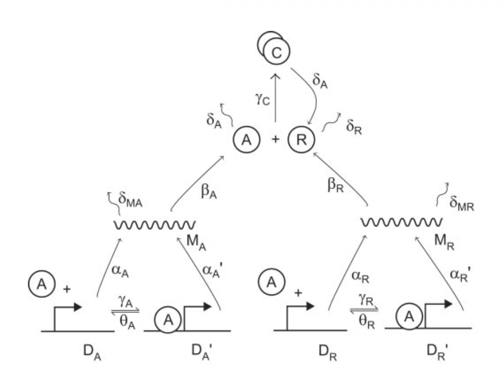
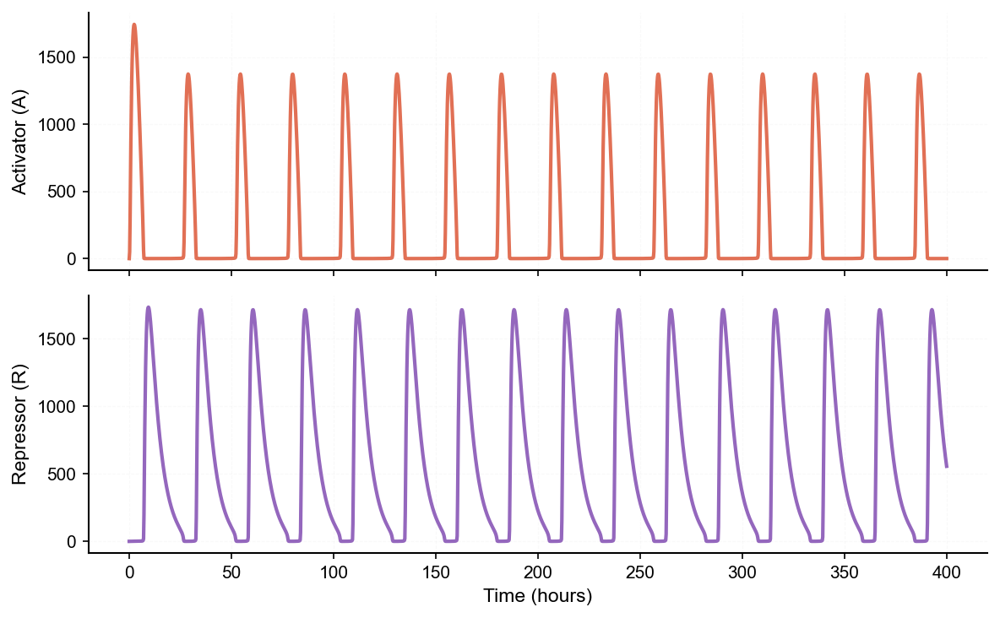
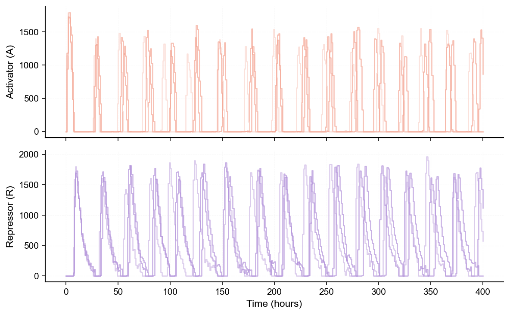
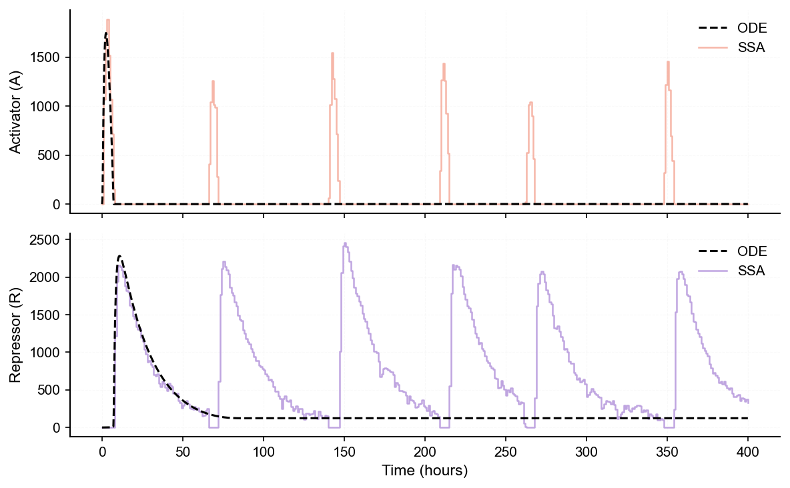
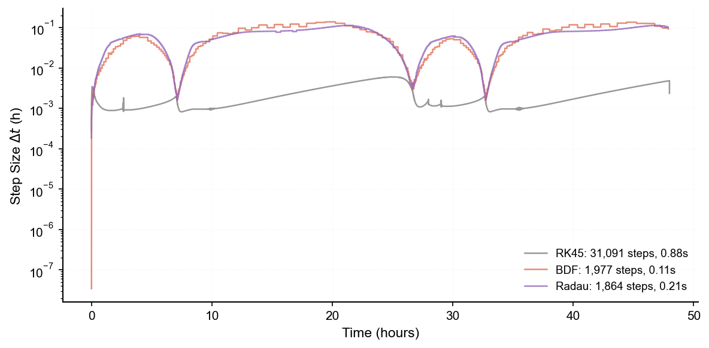
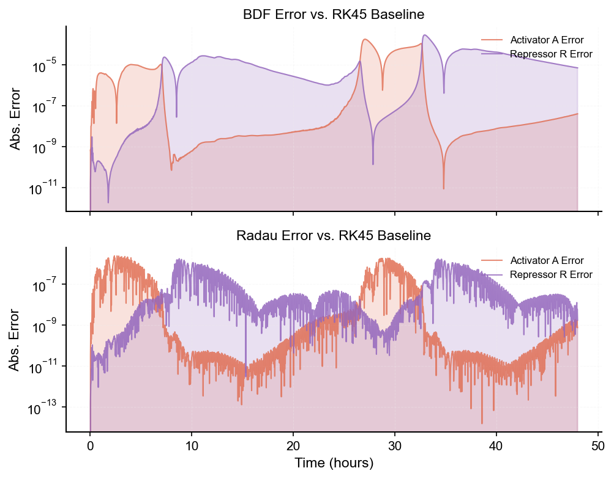

# Deterministic and Stochastic Dynamics of a Reaction Network
## 1. Problem background

This project studies a genetic oscillator in which an activator $(A)$ and a repressor $(R)$ interact through a gene regulatory network with coupled positive and negative feedback. In the VKB circadian clock model (Vilar et al., 2002), these interactions are represented by a 16-reaction mass-action system whose dynamics can be analyzed either deterministically or stochastically.

A central question is how intrinsic noise affects the system’s dynamics. To address this, the project compares two complementary descriptions of the same biochemical system:

- deterministic modeling with ordinary differential equations (ODEs), which captures the average population-level behavior;
- stochastic modeling with a stochastic simulation algorithm (SSA), which resolves discrete reaction events and molecule-number fluctuations.

The comparison focuses on two regimes. At $s_R = 0.2$, both the deterministic and stochastic models exhibit sustained oscillations, so noise mainly perturbs phase and amplitude. At $s_R = 0.05$, the deterministic ODE converges to a stable equilibrium, while the SSA continues to show oscillatory behavior driven by intrinsic fluctuations. This contrast distinguishes when noise acts as a perturbation and when it qualitatively changes the system dynamics.

## 2. Method

The system is modeled using the VKB genetic oscillator, a biochemical reaction network involving an activator $(A)$, a repressor $(R)$, promoter binding, transcription, translation, degradation, and activator-repressor complex formation. The same underlying reaction network is used in both the deterministic and stochastic descriptions so that the influence of intrinsic noise can be assessed directly.

<div align="center">


**Figure 1.** Reaction network underlying the deterministic and stochastic models.
</div>

### Deterministic model

In the deterministic formulation, the system is represented by a set of ordinary differential equations (ODEs) derived from the reaction network under mass-action kinetics. These equations describe the time evolution of the molecular species as continuous variables and provide the mean-field dynamics of the oscillator.

The ODE system is integrated numerically to obtain system trajectories and long-term behavior.

### Stochastic model

In the stochastic formulation, the same biochemical system is treated as a sequence of discrete reaction events. Each reaction occurs randomly, with probabilities determined by its propensity.

To simulate these dynamics, the project uses the Gillespie stochastic simulation algorithm (SSA), which generates sample paths of molecule counts by drawing both the next reaction event and the waiting time to that event. Repeated SSA runs are used to quantify trial-to-trial variability caused by intrinsic noise.

### Simulation setup

All simulations use the same reaction network and parameter set, with the repressor transcription parameter $s_R$ varied to compare two characteristic regimes:

- $s_R = 0.2$, where the deterministic model exhibits sustained oscillations;
- $s_R = 0.05$, where the deterministic model converges to a stable equilibrium.

Stochastic simulations are repeated multiple times in each regime to capture variability and to determine whether noise only perturbs the deterministic dynamics or instead generates qualitatively different behavior.

## 3. Results

The behavior of the system is examined under two parameter regimes to compare deterministic and stochastic models.

### Case 1: Oscillatory regime ($s_R = 0.2$)

In this regime, both deterministic and stochastic models exhibit sustained oscillations.

The deterministic ODE produces regular and periodic trajectories. In contrast, the stochastic simulations show similar oscillatory patterns but with variability in amplitude and phase across different runs.

<div align="center">


**Figure 2.** Deterministic ODE trajectory for activator $A$ and repressor $R$ at $s_R = 0.2$.
</div>

<div align="center">


**Figure 3.** Three SSA trajectories for activator $A$ and repressor $R$ at $s_R = 0.2$.
</div>

This indicates that intrinsic noise perturbs the oscillations but does not change their qualitative behavior.

### Case 2: Noise-induced oscillations ($s_R = 0.05$)

In this regime, the deterministic model converges to a stable equilibrium, indicating the absence of oscillations.

However, the stochastic simulations continue to exhibit sustained oscillatory behavior. Different simulation runs show variability, but all maintain oscillations over time.

<div align="center">


**Figure 4.** ODE and SSA trajectories at $s_R = 0.05$, showing deterministic relaxation and stochastic oscillations.
</div>

This demonstrates that intrinsic noise can drive the system away from the stable equilibrium and sustain oscillations that are not present in the deterministic model.

## 4. Discussion

The results show that intrinsic noise affects system dynamics in two ways. In oscillatory regimes, noise introduces variability without changing the overall behavior. In contrast, near stable equilibria, noise can qualitatively change the system by sustaining oscillations that are absent in the deterministic model.

These findings highlight the importance of stochastic modeling when random fluctuations play a significant role in system behavior.

---

## Appendix

### Appendix 1: Comparison of integration solvers

To assess the numerical properties of the deterministic model, three ODE solvers are compared over a 48 h simulation: explicit RK45 and the implicit stiff solvers BDF and Radau.

The internal step-size histories show that BDF and Radau behave similarly over time, while RK45 requires much smaller time steps across most of the simulation. This is consistent with the VKB oscillator being a stiff system for which implicit solvers are more efficient.

<div align="center">


**Figure A1.** Internal step sizes $\Delta t$ for RK45, BDF, and Radau over 48 h.
</div>

An additional error-versus-cost comparison shows that BDF is faster but less accurate, whereas Radau is slower and substantially more accurate. For the main long-time simulations, BDF is used as the practical default because it provides a favorable trade-off between speed and accuracy.

<div align="center">


**Figure A2.** Trajectory error for BDF and Radau relative to a high-precision RK45 reference.
</div>

### Appendix 2: Quick start and reproducibility

**Environment:** Python **3.9+** recommended.

```bash
conda create -n genetic-oscillators python=3.9
conda activate genetic-oscillators
pip install -r requirements.txt
```

**Pipelines**

| Command                  | Purpose                                |
| ------------------------ | -------------------------------------- |
| `python main.py all`     | Run the full reported analysis pipeline |
| `python main.py core`    | Baseline and numerics only             |

## References

[1] Vilar, J. M., Kueh, H. Y., Barkai, N., & Leibler, S. (2002). Mechanisms of noise-resistance in genetic oscillators. *PNAS*, 99(9), 5988-5992.
